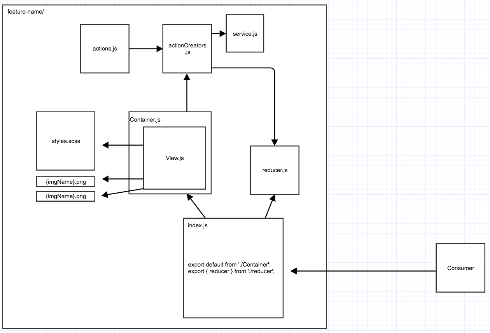

## The Goal
What we want to achieve is a high level of encapsulation for individual component's within this project. In an ideal world edge node components that expose a feature should be self contained and the ability to add a feature would be as simple as `import Component from './feature';` within the component that wants to display the feature
or deleting the directory if we no longer want the feature. If a feature is composed of smaller features, the directory structure should represent this, only when those smaller features are dependencies of unrelated components would result in that model not being applied.

## Directory Breakdown
A typical component directory structure that exposes a feature on the website should look like this:
```
js
├── components
│    ├── feature-name
│    │   ├── __tests__
│    │   │   ├── View-spec.js
│    │   │   └── Container-spec.js
│    │   ├── View.js         
│    │   ├── Container.js         
│    │   ├── {featureImage}.png           
│    │   ├── actionCreator.js
│    │   ├── actions.js
│    │   ├── index.js
│    │   ├── styles.scss          
│    │   ├── reducer.js
│    │   ├── service.js
``` 
The file names are intentionally generic to signify it's purpose for the role it plays in rendering a feature. We are striving for it to be as obvious as possible that just looking at a directory of a feature you'll have a good sense of what parts go into making that feature work.

## Feature Component Diagram
Here is a visual representation of what a full featured component might look like
<div style="text-align:center">
    
</div>


### File responsibilities
#### `__tests__`
You'll notice we are placing the tests with the feature rather then in another part of the app, this has been discussed in-depth as we were coming up with this structure [here](https://git.realestate.com.au/cobra-psw/property-listings-web/issues/589#issuecomment-31315). With the tests living along side the src it makes it trivial to move components without having to apply any changes to the tests. And with Webpack creating the bundled application there is no fear in those tests being packaged to production as they have there own dependency tree graph.

#### `View.js` (Dumb Components)
This is typically the most common file within a feature, and it's contents are a presentational react view, more often then not it contains no state and is usually a declarative representation of the HTML and css classes.
``` 
   export default ({loggedIn}) => (<div>{loggedIn ? `hello world` : `boo not logged in`}</div>);
```
Typically adheres to the following checklist:
- Describe how things look
- Receive only props, providing data and callbacks
- Rarely have own state, when they do, it’s just UI state
- Named anything that’s a UI noun
Most of the time a feature has just one presentational View. If the feature warrants multiple Views then the View's filename should be descriptive of the what it is. 


#### `Container.js` (Smart Components)
This file is your smart Component and wraps your view, I like to think of it as a controller for a particular View, and if one exists is usually the component that is exported.
Typically adheres to the following checklist:
- Describe how things work
- Provide no DOM markup or styles But renders one that does
- Provide application data, do data fetching
- If redux is involved it dispatches actions and can maps state to props
- Named *Container by convention

#### `Images`
Images we place within the component and we opt for a name that describes the image rather then the feature, it would be included within a `View.js` file like:
```
import prettyCat from 'pretty-cat.jpg';

export default () => 
```
This works because we have setup the applications webpack configuration to handle components that import images.

#### ```styles.scss```
styles.scss usually has a 1 to 1 mapping to `View.js` in the case that a component is made up of additional Views, that have additional styles, the convention that follows is the same with how we handle View's; the name of the additional scss files become the name of the View it corresponds to.

#### ```index.js```
This file is responsable for exporting the modules that are required to render the feature. Typically you'll see:
- If the feature only has a View.js this will be your export
- If the feature has a Container.js this will be your export rather then View.js
- If the feature uses redux you would export a Container as default and a reducer, so it can be added to the rootReducer
```
export default from './Container';
export { reducer } from './reducer';
```
- If the feature has a styles.scss, we'll import the scss here so it can be picked up by Webpack. 
```
import from './styles.scss';
```

#### ```service.js```
This file would be where an API request is made, and it's type is often in the shape of a Promise:
```
export default (params) => restWrapper(buildRequest(params)).then(formatResponseForComponent);
```

### Redux
Redux itself is well documented and everything we do here is nothing outside of what redux recommends. Check out the documentation for Redux if you have no idea what it is [http://redux.js.org/](Redux). Also read the ["When to use Redux" wiki page](https://git.realestate.com.au/cobra-psw/property-listings-web/wiki/When-to-use-Redux) which provides a guideline for deciding if you really need redux for your feature component.

A quick reference for this project:

#### `action.js`
This file should just be a an object of strings we use within the actionCreators.

#### `actionCreators.js`
The exported functions that dispatch events and data that the reducer will use to change it's store.

#### `reducer.js`
Essentially it is the state/store of the component, this is exported in the index file so we can hook it up to the rootReducer.